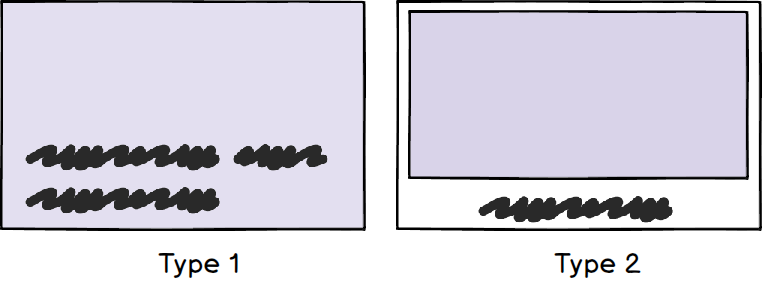
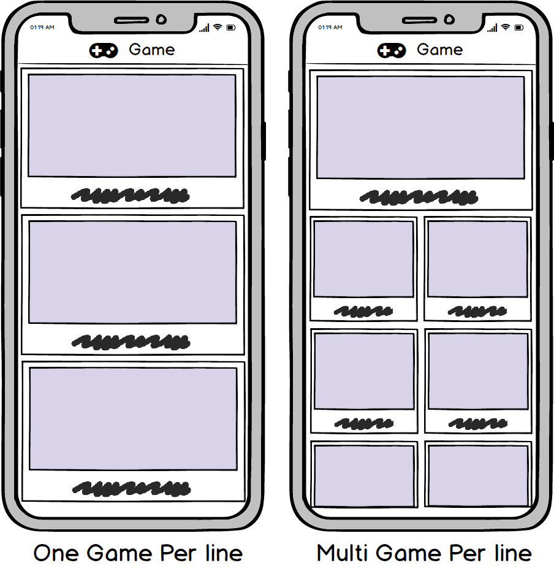
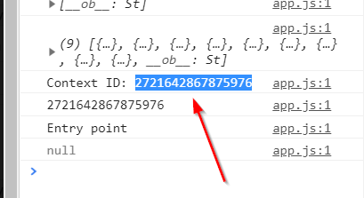

# Front end Features

Igbro front end comes loaded with features. In this guide we'll walk you throught them and how to setup those.

It is not necessary that you set up all the features but these are good features to have

- Google analytics support
- Deep link (custom app link) support
- Translate game according to user languages
- Get languages from user locale
- Design and color customization options

<hr>

## Google analytics


You can integrate google analytics in your instant game easily. this will allow you to see realtime users and it fires an event for all app plays and shares.
<div class='embed-container'><iframe src='https://www.youtube.com/embed//zg_wypNuVDU' frameborder='0' allowfullscreen></iframe></div>


- Sign up for Google analytics if you haven’t already
- Create a new property as shown in the below video and copy the tracking id.
- In the domain field you may enter **https://www.facebook.com/**

<div class='embed-container'><iframe src='https://www.youtube.com/embed//FeAkKWmyW4w' frameborder='0' allowfullscreen></iframe></div>


- Paste it in analytics.js and also change window.analytics to true
```js
    window.analyticsId = "UA-XXXX-YY";  //set this to your tracking id
    window.analytics = true;  //set this to true
```
- Now you’re ready to use Google Analytics in your instant game ☑️ 


<hr>


## Set Up Text/Languages (Optional)

You can change the text appearing in different parts of the app and also change them according to user language. The default language is en(english). You can change the english text as well as add other languages. 
For the language codes you can use the admin panel. Watch the video on how to do it

<div class='embed-container'><iframe src='https://www.youtube.com/embed//jYIQCPjQGrM' frameborder='0' allowfullscreen></iframe></div>


- Now if window.getFromLocale is set to true then the game will try to auto detect language from userLocale we get from Facebook.
- If set to false then it will open the language box by default the first time for the user to choose.
```js
    window.getFromLocale = true;
```

<hr>


## Design Modifications (Optional)

The new version allows you to change colors and design of the instant games. 
Colors take the value of RGB hex codes with a “#” in the front. 
read more about Hex codes
Open **data/styles.js**:
```js
window.appStyles = {
    navbarColor: "#1e74ff",
    navbarTextColor: "#fff",

    languageBoxColor: "#00d1b2",
    languageBoxTextColor: "#fff",
    languageBoxSelectedColor: "#567fd9",
    languageBoxSelectedTextColor: "#fff",

    backgroundColor: "#e9eaee",
    youMayAlsoLikeColor: "#fff",
    footerTextColor: "#555",

    // appComponent specifies which design the app in home and related should be
    appComponent: "singleAppOld",  // can be "singleApp" or "singleAppOld" 
    appTitleColor: "#fff", //color of app title in home or related.

    shareButtonOnTop : true,
    facebookShareButtonColor : "#1e74ff",
    facebookShareButtonBorderColor : "#2567d1",
    facebookShareButtonTextColor : "#fff",

    retryButtonColor : "#262626",

    oneAppPerLine : true,
}

```

- Read the variable name to understand what does it affect. For instance facebookShareButtonColor is facebook Share Button Color.
- **appComponent** : Can have values "singleApp" or "singleAppOld" It defines how apps are displayed in home and related page

- **oneAppPerLine** : Can have values **true** or **false** It defines how apps are displayed in home and related page



<hr>


## Adding DeepLinks in to specific Quizzes.

This step is a tricky one. So please read carefully.

For this to work you need to have a version 4 game in production first. 
So read this: Push game to production


- Open the instant game to play in chrome or firefox
- Open JavaScript console (control+shift+j in chrome windows)
- Now our custom links will be of the form:
    **https://fb.gg/play/yoloplay/en_12**
- Where:

| en | Set game language                                |
| --- | ------------------------------------------------ |
| 12 | App id of the specific quiz from the admin panel |


- Now choose a quiz/app you want a custom link for.
- And choose a language you want to be default when the user opens it.
- If you don’t have multi-language set the language to en always
-  Let our language be ml and app be 32
- Form a link with this data :
    **https://fb.gg/play/yoloplay/ml_32**
- Open this link in the browser
- Now after the game loads up you’ll see many things popping up in your console. look for “**Context ID**”



- Copy that and open contexts.js in data folder
- There is a default entry. You can overwrite it or make a new one as shown:
```js
    window.contextIds = 
    [
        {
            "id" : "en_19",
            "context_id" : "2808837062471283"
        },
        {
            "id" : "ml_32",
            "context_id" : "2721642867875976"
        }
    ]
```

- Do this for all apps and languages you want. 
- Now you can zip, upload and push to production again.
- Now if you check the previous link will lead to our specific app.
    **https://fb.gg/play/yoloplay/ml_32**
- Your custom link is ready

<hr>


## Push Game to production 

Pushing to production means to enable the game so the players can play the new version.

In order to push the game to production, 

- Zip all the files together
- Upload the game to the web hosting tab
- Click the star button next to the new version after scanning complete
- Done ✅ 