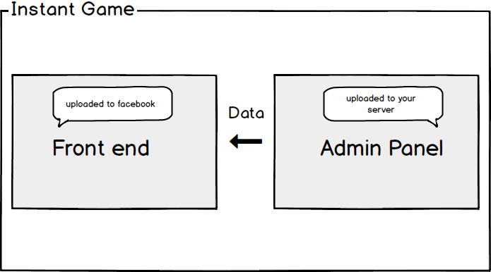
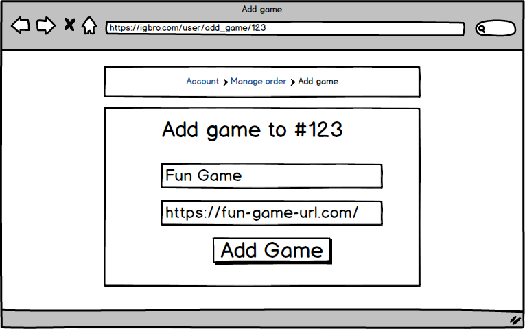
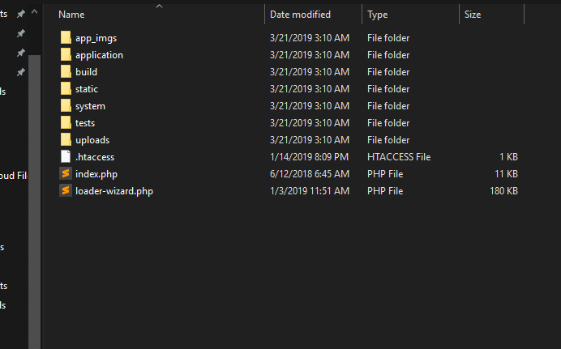

# Installation

This documentation explains you how to install IGBro

## Introduction


The game is divided into 2 parts:
> - **Admin Panel** : `where the quizzes are made`
> - **Front end** : `which is uploaded to facebook`



In order to install the game we'll first install the admin panel.
and then install the front end, although order does not matter.

You need a server/hosting to install the admin panel along with a domain *(You can install in a subdirectory/subdomain of a domain that you already use for some other matter)*

<hr>

## Admin panel


### Prerequisites 🌟Important🌟
-	Domain or subdomain should have ssl (https)
-	The following server requirements:
    > **PHP v7.2** <br>
    > **Apache Server** <br>
    > **Ioncube Loader** for PHP 7.2
-	It is better to install in a subdomain or sub directory like **quiz.mywebsite.com** or **mywebsite.com/quiz**

### Add a Game in IGBro.com
-   Login in IGBro and visit your accounts section
-   Under Products go the **Manage** section of your selected product
-   Add a game there.
    
    -   **Name** - Name it your game name (doesn't really matter)
    -   **URL** - Add the url where you're gonna install it in your website. You'll see more about this soon in this tutorial.


### Import database file ⚙️

In order to make a database you can use mysql via ssh or use any management tools like cpanel or vesta-cp.

-	Make a database in your server (store the db_name, username, pwd temporarily in a notepad)
-	Use [phpmyadmin](https://phpmyadmin.net)  to login with the database credentials and import `database.sql`


### Hosting the Files 📁 

Make sure if you’re using linux or mac you have hidden files shown. So as to show .htaccess otherwise you’ll miss it when zipping

In order to upload files to your server you can use a ftp program file Filezilla, Cyberduck, etc or a management platfrom which includes a file manager like cpanel or vestacp.

-   Extract the Admin panel zip file
-   Zip all the files inside the admin panel folder. Do not miss the `.htaccess` file (show hidden files if you're on a mac or linux or you'll miss it while zipping)

-	Upload the new Admin panel zip file to your server
-	Expand(extract) it there in your server. 
-	Delete the zip file from the server(If you don’t wanna he hacked)
-   Now you need to configure the admin panel
-	Open these files in an editor
    -	`application/config/config.php`
        ```php
        $config['base_url'] = 'https://quiz.mywebsite.com/';

        ```
        -	Find the property **baseUrl** and change it (include the ending forward slash- / ). Use the same baseUrl you added here to add a game into user account/ products for the licensing to work.
        -	**https** is a must for intant games to work with Facebook

    -	`application/config/constants.php`
            ```php
            //custom
            define('SITE_NAME', 'Yolo');
            define('SITE_DESC', 'Fun Quizzes');
            define('GAME_ID', '1');
            define('GAME_LICENSE', '9778-2988-ABCE-XYZ6');
            ```
        -	Scroll down and edit the site name
        -	Add License Code from user accounts section/products in IGBro website. 
        -	After you add a game in the IGBro admin panel, you'll get a game ID. add that here. Note Game ID is **not** the same as serial number(SL.no)

    -	`application/config/database.php`
        ```php
        'hostname' => 'localhost',
        'username' => 'user',
        'password' => 'pass',
        'database' => 'yolo_db',
        ```
        -	edit database,username,password from previously saved data
-	Give the folders app_imgs and uploads full permissions (777) \- *you'll find this if you right click and choose permissions/properties depending on your file explorer. Just check all the permissions*
-	Now visit your site https://quiz.mywebsite.com/ 
-	You’ll be redirected to login page.
-	Use the credentials to login  :
    -	`admin`
    -	`password`

-   If everything is working go ahead and delete the `loader-wizard.php` from the root directory.
-   If you have an error related to **ioncube** goto `https://quiz.mywebsite.com/loader-wizard.php` and it'll guide you on how to fix the error.
-   After that delete the `loader-wizard.php` file for safety.
-   You're good to go!


<hr>


## Front end Installation


Installing IGBro front is very straight forward. Everything that the user is required to edit is moved into the `/data` folder.

If you're unfamiliar with Facebook instant games Please read this before continuing: [Instant Games getting started](/start/)

-   Extract the front end zip file
-   In `data/setup.js` edit your server url
    ```js
    // Including the forward slash
    window.apiUrl = "https://quiz.mywebsite.com/";  
    ```
-   Change `logo.png` to your app Icon and you're pretty good to go.
-   There are a lot of things you can customize in the instant game front end file. Read this before continuing : [IGBro Features](/frontend/)

-   Zip the files and upload it into facebook instant game web hosting tab
-   You may now push this to production and test your app (You'll get game url in **details** tab)
